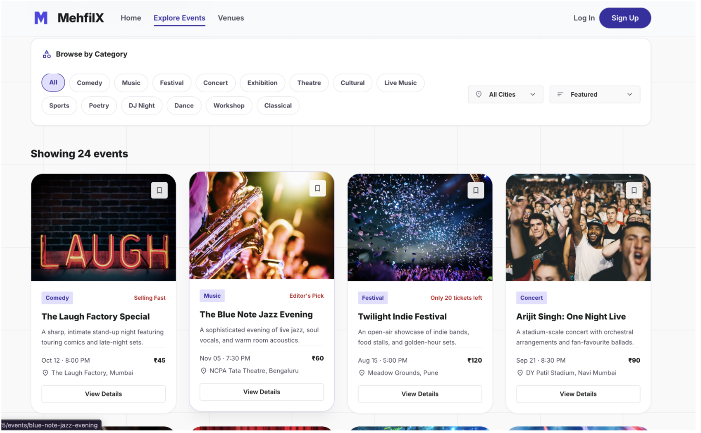
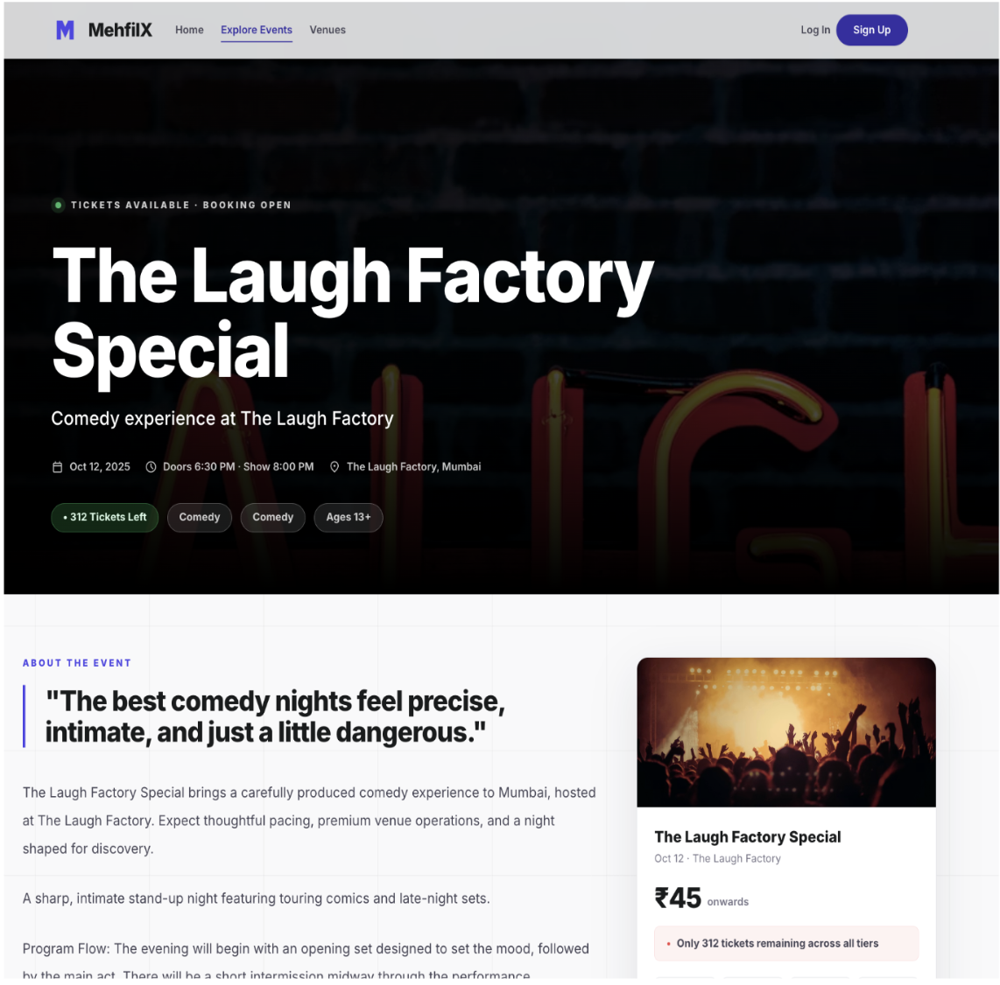
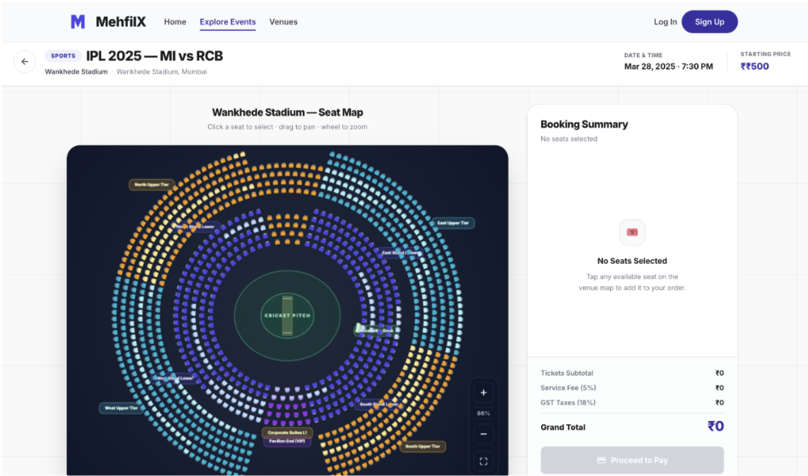
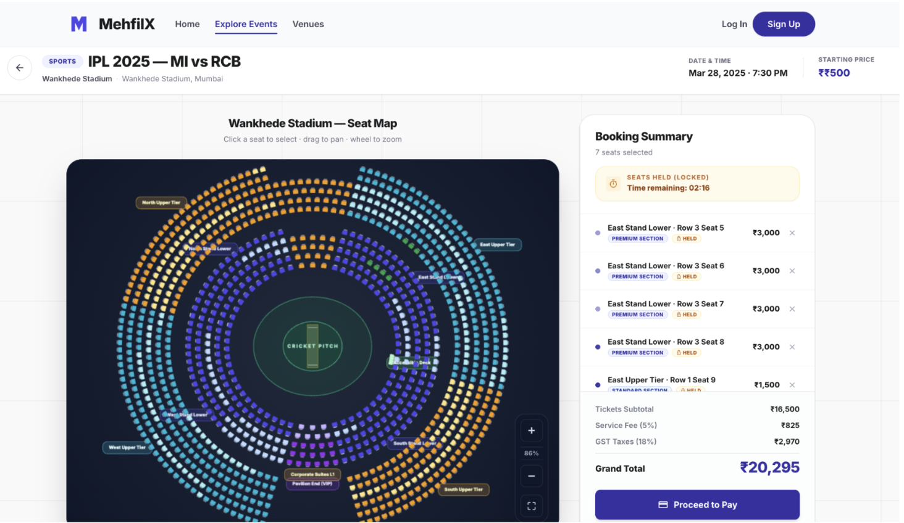
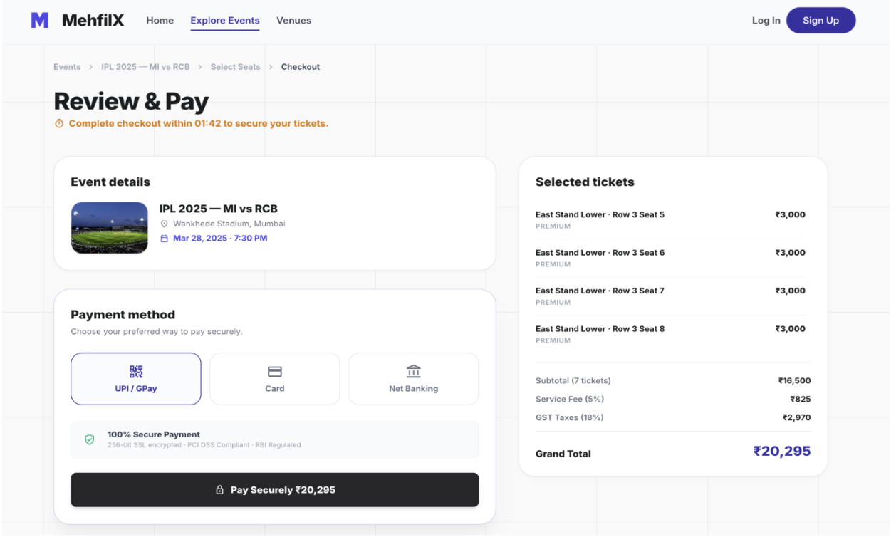
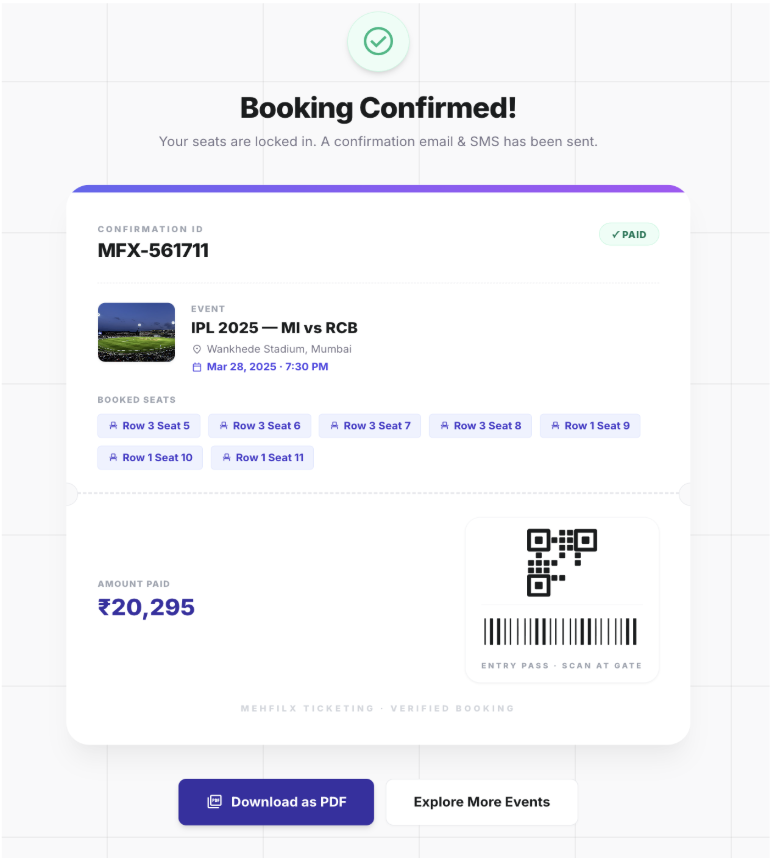

# CASE STUDY REPORT (REACT)

# MehfilX

### Every Great Night Starts With A Mehfil.

---

# Document Information

| Field        | Value                                     |
| ------------ | ----------------------------------------- |
| Project Name | MehfilX                                   |
| Project Type | Event Discovery & Ticket Booking Platform |
| Author       | Lokendra Joshi                            |
| Date         | 16th June, 2026                           |

---

# Executive Summary

MehfilX is a modern event discovery and ticket booking platform designed to provide users with a seamless experience from event exploration to ticket confirmation.

The project focuses on solving common challenges associated with ticket booking platforms, including event discovery, venue visualization, seat selection, reservation management, and checkout workflows.

Unlike traditional booking interfaces, MehfilX introduces a high-performance PixiJS-powered seat selection system capable of rendering large venue layouts containing thousands of seats while maintaining smooth interactions and responsive user experiences.

The platform currently supports event discovery, venue exploration, interactive seat selection, seat reservation workflows, checkout simulations, and booking confirmations.

---

# 1. Project Background

## Problem Statement

Many ticket booking platforms suffer from:

* Overwhelming user interfaces
* Slow seat map rendering
* Poor mobile experiences
* Confusing booking workflows
* Lack of immersive venue visualization
* Unclear reservation handling

Users frequently abandon bookings due to poor seat selection experiences or confusing checkout processes.

The objective of MehfilX was to redesign this journey using modern frontend technologies while maintaining simplicity and performance.

---

## Project Goal

The primary goal of MehfilX is to create a premium ticket booking experience that allows users to:

* Discover events effortlessly
* Explore venue information
* Select seats interactively
* Complete bookings confidently
* Receive digital tickets instantly

---

# 2. Objectives

## Business Objectives

* Improve event discoverability
* Simplify ticket purchasing
* Create a premium booking experience
* Increase booking completion rates

---

## Technical Objectives

* Build a scalable React architecture
* Implement large-scale seat rendering
* Support venue layouts exceeding 10,000 seats
* Create a responsive experience
* Simulate real-world booking workflows

---

# 3. Target Users

## Primary Users

### Event Attendees

Users looking to:

* Attend concerts
* Attend stand-up comedy shows
* Attend festivals
* Attend sporting events

---

### Casual Event Explorers

Users who:

* Browse upcoming events
* Compare venues
* Discover experiences nearby

---

# 4. Technology Stack

## Frontend

* React.js
* React Router DOM
* JavaScript (ES6+)

---

## Styling

* Tailwind CSS

---

## Rendering Engine

* PixiJS
* WebGL

---

## Development Environment

* Vite
* ESLint

---

# 5. System Architecture Overview


MehfilX follows a component-driven React architecture where React Router manages navigation between application pages. Business data is provided through dedicated data modules and shared state management layers. The PixiJS rendering engine powers the interactive seat-selection experience, while the reservation layer manages seat holds and checkout synchronization. The workflow culminates in payment processing and ticket generation.

---

# 6. User Journey

```text
Home Page
      ↓
Explore Events
      ↓
Event Discovery
      ↓
Event Details
      ↓
Book Tickets
      ↓
Seat Selection
      ↓
3-Minute Seat Hold Activated
      ↓
Checkout
      ↓
Payment Processing
      ↓
Booking Confirmation
      ↓
QR Ticket Generated
```

---

# 7. Key Features

## 7.1 Event Discovery

The Event Discovery page serves as the central browsing hub for users.

### Features

* Category filters
* City filters
* Sorting options
* Featured events
* Responsive cards

### Screenshot Placeholder



---

## 7.2 Event Details

The Event Details page provides comprehensive event information before ticket purchase.

### Features

* Hero banner
* Artist lineup
* Event schedule
* Venue information
* Ticket tiers
* Booking CTA

### Screenshot Placeholder



---

## 7.3 Interactive Seat Selection

This is the flagship feature of MehfilX.

The seat map is powered by PixiJS and WebGL to support large venue layouts efficiently.

### Features

* Interactive seat selection
* Real-time updates
* Hover tooltips
* Zoom controls
* Seat legend
* Booking summary

### Technical Highlights

* WebGL rendering
* PixiJS canvas
* Large-scale seat visualization
* Dynamic seat states

### Screenshot Placeholder



---

## 7.4 Seat Reservation Workflow

A temporary reservation mechanism prevents accidental seat conflicts.

### Workflow

1. User selects seats
2. Seat hold timer starts
3. Reservation persists across pages
4. User completes checkout
5. Reservation expires automatically if abandoned

### Screenshot Placeholder



---

## 7.5 Checkout Experience

The checkout page guides users through payment completion.

### Supported Methods

#### UPI

* UPI ID
* QR Code

#### Cards

* Credit Card
* Debit Card

#### Net Banking

* SBI
* HDFC
* ICICI
* Other Banks

### Screenshot Placeholder



---

## 7.6 Booking Confirmation

Users receive a digital ticket upon successful payment.

### Features

* Booking ID
* QR Code
* Ticket Summary
* Seat Information

### Screenshot Placeholder



---

# 8. Design System

## Design Philosophy

MehfilX follows a dual-theme approach.

### Light Experience

Used for:

* Discovery
* Event Information
* Checkout
* Authentication

#### Focus

* Clarity
* Readability
* Simplicity

---

### Venue Experience

Used for:

* Seat Selection

#### Focus

* Immersion
* Visual Contrast
* Event Atmosphere

---

# 9. Technical Challenges

## Challenge 1

### Rendering Large Venue Layouts

#### Problem

Traditional DOM rendering struggles when thousands of seats are displayed simultaneously.

#### Solution

PixiJS and WebGL were used to render seat layouts efficiently.

#### Result

Support for venue maps exceeding 10,000 seats.

---

## Challenge 2

### Seat Reservation Synchronization

#### Problem

Users may navigate between pages while maintaining seat selections.

#### Solution

A synchronized hold timer was implemented across the booking workflow.

#### Result

Consistent reservation behavior.

---

## Challenge 3

### Responsive Booking Experience

#### Problem

Complex booking flows often break on mobile devices.

#### Solution

Dedicated mobile booking interfaces and responsive layouts were implemented.

#### Result

Consistent experience across screen sizes.

---

# 10. Performance Considerations

## Optimizations

* WebGL rendering
* Component reuse
* Efficient data structures
* Lightweight React hierarchy

---

## Achievements

* 10,000+ seat support
* Responsive layouts
* Fast rendering
* Smooth interactions

---

# 11. Results & Outcomes

Current MVP successfully demonstrates:

* End-to-end booking flow
* Interactive seat selection
* Reservation workflow
* Checkout simulation
* Digital ticket generation

The project validates the feasibility of a modern ticket booking experience powered by React and PixiJS.

---

# 12. Lessons Learned

Key learnings from developing MehfilX:

* Large-scale rendering requires specialized tools
* User experience is critical during booking flows
* Reservation management significantly impacts usability
* Responsive design must be considered from the beginning
* Visual performance directly affects user engagement

---

# 13. Future Roadmap

## Phase 1

* Buyer Dashboard
* Organizer Dashboard
* Admin Dashboard

---

## Phase 2

* Backend Integration
* Real Payment Gateway Integration
* Authentication System

---

## Phase 3

* Real-Time Seat Locking
* Live Event Analytics
* Advanced Venue Management

---

## Phase 4

* Premium Memberships
* VIP Experiences
* Exclusive Event Access

---

# 14. Project Link

## Source Code Repository

The complete source code for MehfilX is available on GitHub.

**GitHub Repository**

https://github.com/ShidoStack/react-project/

---

## Live Application

Experience MehfilX live.

**Live Demo**

https://mehfilx.vercel.app/

---

# Conclusion

MehfilX demonstrates how modern frontend technologies can be used to create an immersive, scalable, and user-friendly ticket booking platform.

Through the use of React, Tailwind CSS, and PixiJS, the platform delivers a smooth booking experience while showcasing advanced frontend engineering concepts such as WebGL rendering, seat reservation workflows, and responsive application architecture.

The project serves as both a practical event booking solution and a demonstration of scalable frontend design principles.
